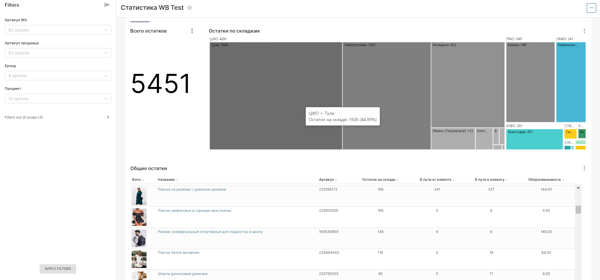

Данный репозиторий представляет из себя ТГ чат-бота для поддержки сервиса аналитики для маркетплейсов

За основу была взята предобученная модель rugpt3small_based_on_gpt2. Далее эта модель была дообучена на сформированном датасете. Для повышения точности ответов модели проводидась аугментация данных путем перевода на другой язык и обратно. Также пытался осуществить аугментацию путем использования других нейронок, но к T5 и BERT показались очень глупыми, а для доступа по API к GPT нужен был платный токен :(

Эволюцию датасета можно посмотреть таким образом dataset.csv -> new_dataset.csv -> new_dataset1.csv

Блокнот model.ipynb содержит код для дообучения модели. Блокнот upgrade_dataset.ipynb содержит код с аугментацией датасета

Папка bot находится сам ТГ бот

[Репозиторий с бэком для сервиса аналитики](https://github.com/IlyaKlinduhov/mp_vision) 

Вкратце о сервисе: данные получаются по api маркетплейса. Далее заносятся в БД и отображаются на дашбордах в Superset. Каждый юзер видит свои данные благодаря реализации модели RLS в Superset.

